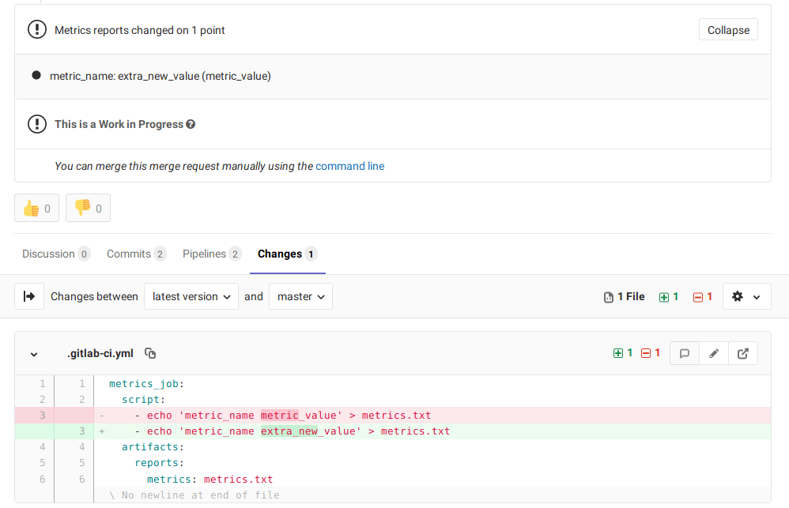

# Metrics Reports **[PREMIUM]**

> [Introduced](https://gitlab.com/gitlab-org/gitlab-ee/issues/9788) in [GitLab Premium](https://about.gitlab.com/pricing) 11.10.
Requires GitLab Runner 11.10 and above.

## Overview

GitLab provides a lot of great reporting tools for [merge requests](../user/project/merge_requests/index.md) - [JUnit reports](./junit_test_reports.md), [codequality](https://docs.gitlab.com/ee/user/project/merge_requests/code_quality.html), performance tests, etc. While JUnit is a great open framework for tests that "pass" or "fail", it is also important to see other types of metrics from a given change.

You can configure your job to use custom Metrics Reports, and GitLab will display a report on the merge request so that it's easier and faster to identify changes without having to check the entire log.



## Use cases

Consider the following examples of data that can utilize Metrics Reports:

1. Memory usage
1. Load testing results
1. Code complexity
1. Code coverage stats

## How it works

Metrics are read from the metrics report (default: `metrics.txt`). They are parsed and displayed in the MR widget.

## How to set it up

Add a job that creates a [metrics report](yaml/README.md#artifactsreportsmetrics-premium) (default filename: `metrics.txt`). The file should conform to the [OpenMetrics](https://openmetrics.io/) format.

For example:

```yaml
metrics:
  script:
    - echo 'metric_name metric_value' > metrics.txt
  artifacts:
    reports:
      metrics: metrics.txt
```
