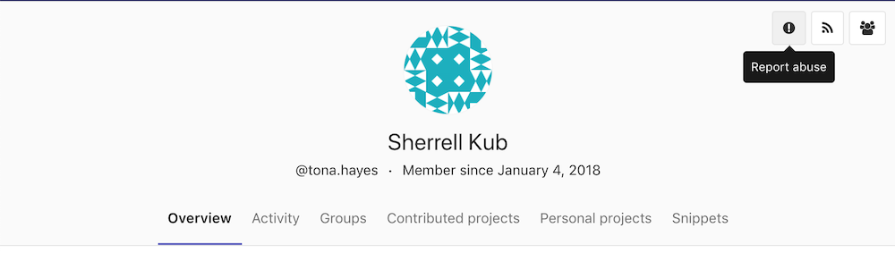
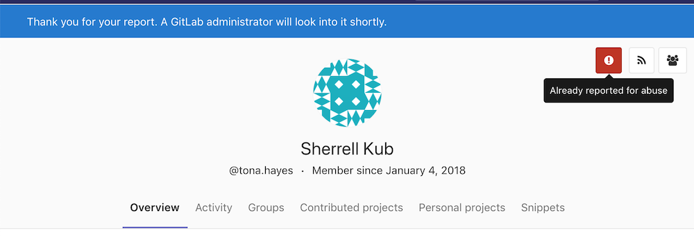
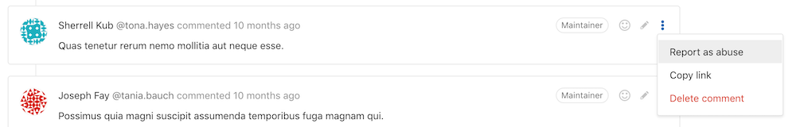
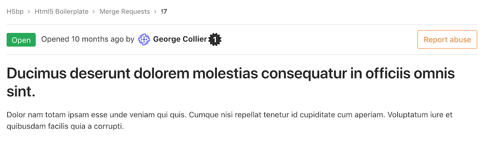
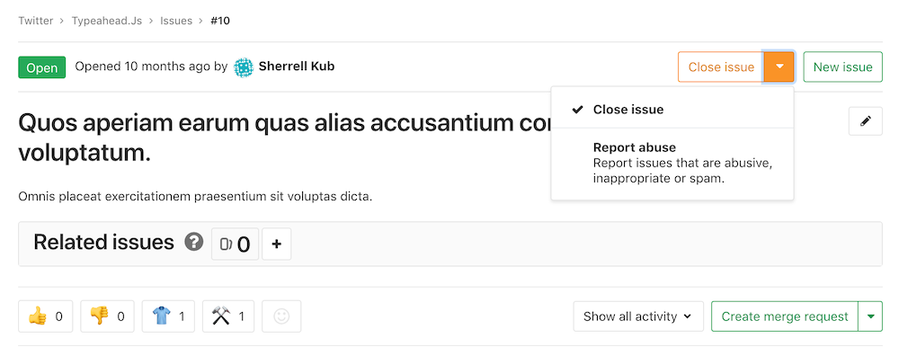
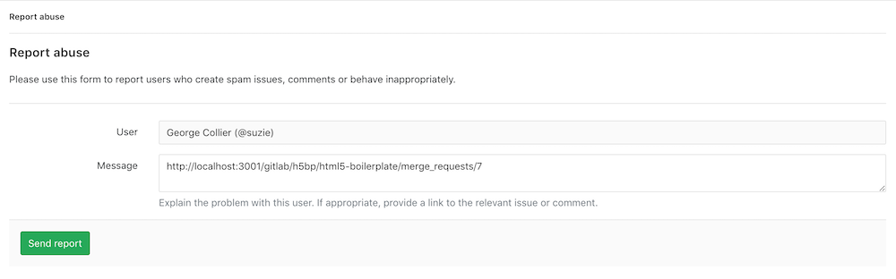

# Abuse reports

Report abuse from other GitLab users to instance administrators.

You can report a user through their:

- [Profile](#reporting-abuse-through-a-users-profile)
- [Comments](#reporting-abuse-through-a-users-comment)
- [Issues and Merge requests](#reporting-abuse-through-a-users-issue-or-merge-request)

profile, comments, issues or merge requests.

## Reporting abuse through a user's profile

To report abuse from a user's profile page, click on the exclamation point
report abuse button at the top right of the user's profile.

When the user has been reported, the report button turns red.

## Reporting abuse through a user's comment

To report abuse from a user's comment:

1. Click on the vertical ellipsis (⋮) more actions button to open the dropdown
1. Select **Report as abuse**

A URL to the reported user's comment will be
pre-filled in the abuse report's **Message** field.

## Reporting abuse through a user's issue or merge request

To report abuse from a user's issue or merge request, click on the
**Report abuse** button at the top right of the issue or merge request.

If you are able to open and close the issue or merge request:, you should

1. Select **Report abuse** in the dropdown to the right of the **Close issue** or **Close merge request** button.
1. Click the resulting **Report abuse** button to visit the report creation page.

A URL to the reported user's issue or merge request will be pre-filled
in the abuse report creation page.

## Submitting an abuse report

After reporting a user using any of the methods described above, you will be
redirected to the report creation page.

The user to be reported will be pre-filled and the message field should be used
to explain the reason for the report.

If you have reported the user through a comment, issue, or merge request,
a URL to the comment, issue, or merge request is pre-filled in the message field.

## Managing abuse reports

Admins are able to view and resolve abuse reports.
For more information, see [abuse reports administration documentation](admin_area/abuse_reports.md).
