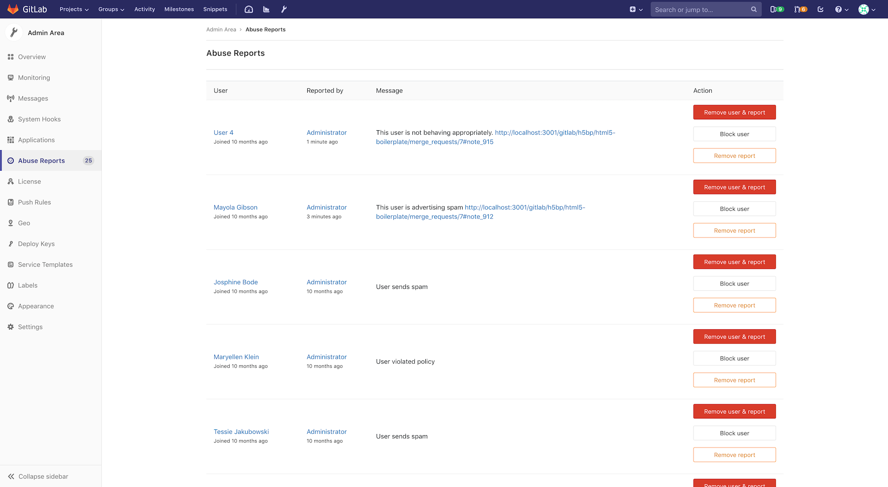
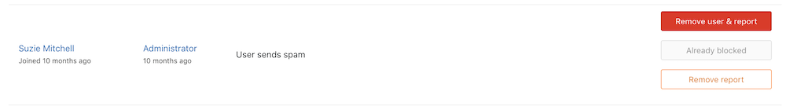

# Abuse reports

View and resolve abuse reports from GitLab users.

Admins can view abuse reports in the admin area and are able to
resolve the reports by removing the reported user, blocking the reported user, or removing the report.

## Reporting abuse

To find out more about reporting abuse, see [abuse reports user documentation](../abuse_reports.md).

## Resolving abuse reports

When you are signed in as a user with admin access, abuse reports can be viewed
on the `/admin/abuse_reports` page.

There are 3 ways to resolve an abuse report:

- Remove user & report: [Deletes the reported user](../profile/account/delete_account.md) from the instance and removes the abuse report from the list.
- Block user: Blocks the reported user from the instance and does not remove the abuse report from the list.
- Remove report: Removes the abuse report from the list and does not restrict the access for the reported user.

## Blocked users

Blocking a user will not remove the abuse report from the list.

Instead, the block button will be disabled and explain that the user is "Already blocked".
You are still able to remove the user and/or report if necessary.

