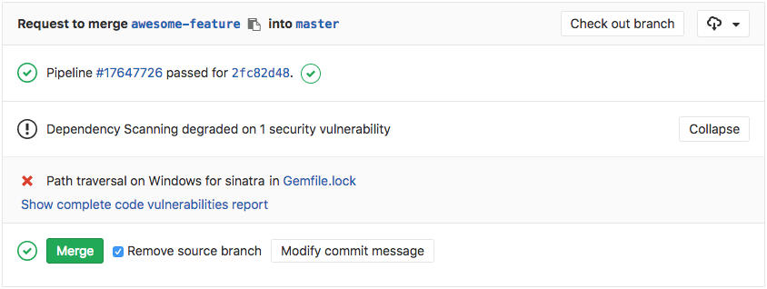

# Dependency Scanning **[ULTIMATE]**

> [Introduced](https://gitlab.com/gitlab-org/gitlab-ee/issues/5105)
in [GitLab Ultimate](https://about.gitlab.com/pricing/) 10.7.

## Overview

If you are using [GitLab CI/CD](../../../ci/README.md), you can analyze your dependencies for known
vulnerabilities using Dependency Scanning.

You can take advantage of Dependency Scanning by either [including the CI job](#including-the-provided-template)
in your existing `.gitlab-ci.yml` file or by implicitly using
[Auto Dependency Scanning](../../../topics/autodevops/index.md#auto-dependency-scanning-ultimate)
that is provided by [Auto DevOps](../../../topics/autodevops/index.md).

GitLab checks the Dependency Scanning report, compares the found vulnerabilities
between the source and target branches, and shows the information right on the
merge request.



The results are sorted by the priority of the vulnerability:

1. High
1. Medium
1. Low
1. Unknown
1. Everything else

## Use cases

It helps to automatically find security vulnerabilities in your dependencies
while you are developing and testing your applications. For example when your
application is using an external (open source) library which is known to be vulnerable.

## Requirements

To run a Dependency Scanning job, you need GitLab Runner with the
[`docker`](https://docs.gitlab.com/runner/executors/docker.html#use-docker-in-docker-with-privileged-mode) or
[`kubernetes`](https://docs.gitlab.com/runner/install/kubernetes.html#running-privileged-containers-for-the-runners)
executor running in privileged mode. If you're using the shared Runners on GitLab.com,
this is enabled by default.

## Supported languages and package managers

The following languages and dependency managers are supported.

| Language (package managers)                                                 | Scan tool                                                                                                                         |
|-----------------------------------------------------------------------------|-----------------------------------------------------------------------------------------------------------------------------------|
| JavaScript ([npm](https://www.npmjs.com/), [yarn](https://yarnpkg.com/en/)) | [gemnasium](https://gitlab.com/gitlab-org/security-products/gemnasium/general), [Retire.js](https://retirejs.github.io/retire.js)         |
| Python ([pip](https://pip.pypa.io/en/stable/)) (only `requirements.txt` supported)  | [gemnasium](https://gitlab.com/gitlab-org/security-products/gemnasium/general)                                                            |
| Ruby ([gem](https://rubygems.org/))                                         | [gemnasium](https://gitlab.com/gitlab-org/security-products/gemnasium/general), [bundler-audit](https://github.com/rubysec/bundler-audit) |
| Java ([Maven](https://maven.apache.org/))                                   | [gemnasium](https://gitlab.com/gitlab-org/security-products/gemnasium/general)                                                            |
| PHP ([Composer](https://getcomposer.org/))                                  | [gemnasium](https://gitlab.com/gitlab-org/security-products/gemnasium/general)                                                            |

Some scanners require to send a list of project dependencies to GitLab's central
servers to check for vulnerabilities. To learn more about this or to disable it,
refer to the [GitLab Dependency Scanning tool documentation](https://gitlab.com/gitlab-org/security-products/dependency-scanning#remote-checks).

## Configuring Dependency Scanning

To enable Dependency Scanning in your project, define a job in your `.gitlab-ci.yml`
file that generates the
[Dependency Scanning report artifact](../../../ci/yaml/README.md#artifactsreportsdependency_scanning-ultimate).

This can be done in two ways:

- For GitLab 11.9 and later, including the provided Dependency Scanning
  `.gitlab-ci.yml` template (recommended).
- Manually specifying the job definition. Not recommended unless using GitLab
  11.8 and earlier.

### Including the provided template

NOTE: **Note:**
The CI/CD Dependency Scanning template is supported on GitLab 11.9 and later versions.
For earlier versions, use the [manual job definition](#manual-job-definition-for-gitlab-115-and-later).

A CI/CD [Dependency Scanning template](https://gitlab.com/gitlab-org/gitlab-ee/blob/master/lib/gitlab/ci/templates/Security/Dependency-Scanning.gitlab-ci.yml)
with the default Dependency Scanning job definition is provided as a part of your GitLab
installation which you can [include](../../../ci/yaml/README.md#includetemplate)
in your `.gitlab-ci.yml` file.

To enable Dependency Scanning using the provided template, add the following to
your `.gitlab-ci.yml` file:

```yaml
include:
  template: Dependency-Scanning.gitlab-ci.yml
```

The included template will create a `dependency_scanning` job in your CI/CD
pipeline and scan your project's source code for possible vulnerabilities.

The report will be saved as a
[Dependency Scanning report artifact](../../../ci/yaml/README.md#artifactsreportsdependency_scanning-ultimate)
that you can later download and analyze. Due to implementation limitations, we
always take the latest Dependency Scanning artifact available.

Some security scanners require to send a list of project dependencies to GitLab
central servers to check for vulnerabilities. To learn more about this or to
disable it, check the
[GitLab Dependency Scanning tool documentation](https://gitlab.com/gitlab-org/security-products/dependency-scanning#remote-checks).

#### Customizing the Dependency Scanning settings

The Dependency Scanning settings can be changed through environment variables by using the
[`variables`](../../../ci/yaml/README.md#variables) parameter in `.gitlab-ci.yml`.
These variables are documented in the
[Dependency Scanning tool documentation](https://gitlab.com/gitlab-org/security-products/dependency-scanning#settings).

For example:

```yaml
include:
  template: Dependency-Scanning.gitlab-ci.yml

variables:
  DEP_SCAN_DISABLE_REMOTE_CHECKS: true
```

Because template is [evaluated before](../../../ci/yaml/README.md#include) the pipeline
configuration, the last mention of the variable will take precedence.

#### Overriding the Dependency Scanning template

If you want to override the job definition (for example, change properties like
`variables` or `dependencies`), you need to declare a `dependency_scanning` job
after the template inclusion and specify any additional keys under it. For example:

```yaml
include:
  template: Dependency-Scanning.gitlab-ci.yml

dependency_scanning:
  variables:
    CI_DEBUG_TRACE: "true"
```

### Manual job definition for GitLab 11.5 and later

For GitLab 11.5 and GitLab Runner 11.5 and later, the following `dependency_scanning`
job can be added:

```yaml
dependency_scanning:
  image: docker:stable
  variables:
    DOCKER_DRIVER: overlay2
  allow_failure: true
  services:
    - docker:stable-dind
  script:
    - export DS_VERSION=${SP_VERSION:-$(echo "$CI_SERVER_VERSION" | sed 's/^\([0-9]*\)\.\([0-9]*\).*/\1-\2-stable/')}
    - |
      docker run \
      --env DS_ANALYZER_IMAGES \
      --env DS_ANALYZER_IMAGE_PREFIX \
      --env DS_ANALYZER_IMAGE_TAG \
      --env DS_DEFAULT_ANALYZERS \
      --env DEP_SCAN_DISABLE_REMOTE_CHECKS \
      --env DS_DOCKER_CLIENT_NEGOTIATION_TIMEOUT \
      --env DS_PULL_ANALYZER_IMAGE_TIMEOUT \
      --env DS_RUN_ANALYZER_TIMEOUT \
      --volume "$PWD:/code" \
      --volume /var/run/docker.sock:/var/run/docker.sock \
      "registry.gitlab.com/gitlab-org/security-products/dependency-scanning:$DS_VERSION" /code
  dependencies: []
  artifacts:
    reports:
      dependency_scanning: gl-dependency-scanning-report.json
```

You can supply many other [settings variables](https://gitlab.com/gitlab-org/security-products/dependency-scanning#settings)
via `docker run --env` to customize your job execution.

### Manual job definition for GitLab 11.4 and earlier (deprecated)

CAUTION: **Caution:**
Before GitLab 11.5, the Dependency Scanning job and artifact had to be named specifically
to automatically extract the report data and show it in the merge request widget.
While these old job definitions are still maintained, they have been deprecated
and may be removed in the next major release, GitLab 12.0. You are strongly advised
to update your current `.gitlab-ci.yml` configuration to reflect that change.

For GitLab 11.4 and earlier, the job should look like:

```yaml
dependency_scanning:
  image: docker:stable
  variables:
    DOCKER_DRIVER: overlay2
  allow_failure: true
  services:
    - docker:stable-dind
  script:
    - export DS_VERSION=${SP_VERSION:-$(echo "$CI_SERVER_VERSION" | sed 's/^\([0-9]*\)\.\([0-9]*\).*/\1-\2-stable/')}
    - |
      docker run \
      --env DS_ANALYZER_IMAGES \
      --env DS_ANALYZER_IMAGE_PREFIX \
      --env DS_ANALYZER_IMAGE_TAG \
      --env DS_DEFAULT_ANALYZERS \
      --env DEP_SCAN_DISABLE_REMOTE_CHECKS \
      --env DS_DOCKER_CLIENT_NEGOTIATION_TIMEOUT \
      --env DS_PULL_ANALYZER_IMAGE_TIMEOUT \
      --env DS_RUN_ANALYZER_TIMEOUT \
      --volume "$PWD:/code" \
      --volume /var/run/docker.sock:/var/run/docker.sock \
      "registry.gitlab.com/gitlab-org/security-products/dependency-scanning:$DS_VERSION" /code
  artifacts:
    paths: [gl-dependency-scanning-report.json]
```

## Security Dashboard

The Security Dashboard is a good place to get an overview of all the security
vulnerabilities in your groups and projects. Read more about the
[Security Dashboard](../security_dashboard/index.md).

## Interacting with the vulnerabilities

Once a vulnerability is found, you can interact with it. Read more on how to
[interact with the vulnerabilities](../index.md#interacting-with-the-vulnerabilities).
