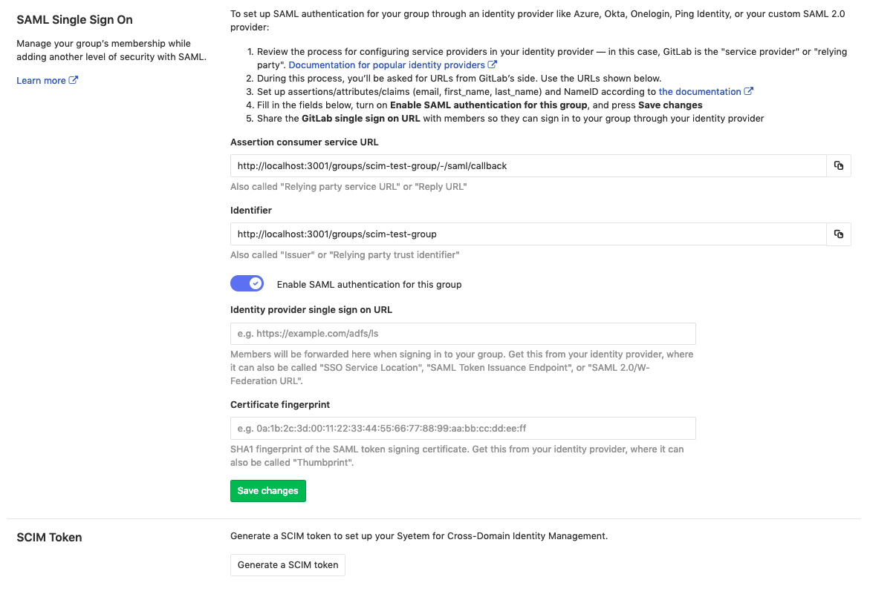
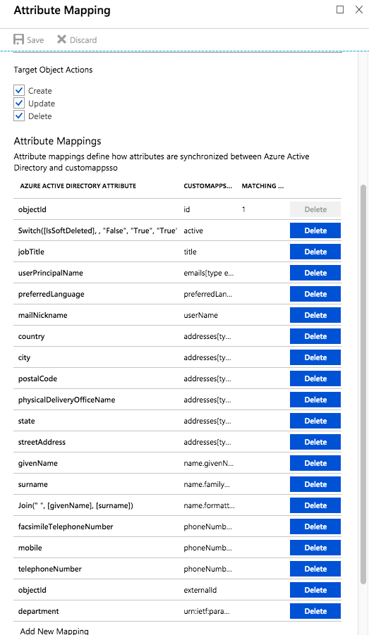

# SCIM provisioning using SAML SSO for Groups **[SILVER ONLY]**

> [Introduced](https://gitlab.com/gitlab-org/gitlab-ee/merge_requests/9388) in [GitLab.com Silver](https://about.gitlab.com/pricing/) 11.10.

GitLab's [SCIM API](../../../api/scim.md) implements part of [the RFC7644 protocol](https://tools.ietf.org/html/rfc7644).

Currently, the following actions are available:

- CREATE
- UPDATE
- DELETE (deprovisioning)

The following identity providers are supported:

- Azure

## Requirements

- [Group SSO](index.md) needs to be configured. 
- The `scim_group` feature flag must be enabled:

    Run the following commands in a Rails console:
    
    ```sh
    # Omnibus GitLab
    gitlab-rails console
    
    # Installation from source
    cd /home/git/gitlab
    sudo -u git -H bin/rails console RAILS_ENV=production
    ```
    
    To enable SCIM for a group named `group_name`:
    
    ```ruby
    group = Group.find_by_full_path('group_name')
    Feature.enable(:group_scim, group)
    ```
    
### GitLab configuration

Once [Single sign-on](index.md) has been configured, we can:

1. Navigate to the group and click **Settings > SAML SSO**.
1. Click on the **Generate a SCIM token** button.
1. Save the token and URL so they can be used in the next step.

    

## SCIM IdP configuration

### Configuration on Azure

In the [Single sign-on](index.md) configuration for the group, make sure
that the **Name identifier value** (NameID) points to a unique identifier, such
as the `user.objectid`. This will match the `extern_uid`  used on GitLab.

The GitLab app in Azure needs to be configured following 
[Azure's SCIM setup](https://docs.microsoft.com/en-us/azure/active-directory/manage-apps/use-scim-to-provision-users-and-groups#getting-started).

Note the following:

- The `Tenant URL` and `secret token` are the ones retrieved in the
[previous step](#gitlab-configuration).
- Should there be any problems with the availability of GitLab or similar
errors, the notification email set will get those.
- For mappings, we will only leave `Synchronize Azure Active Directory Users to AppName` enabled.

You can then test the connection clicking on `Test Connection`.

### Synchronize Azure Active Directory users

1. Click on `Synchronize Azure Active Directory Users to AppName`, to configure
the attribute mapping.
1. Select the unique identifier (in the example `objectId`) as the `id` and `externalId`,
and enable the `Create`, `Update`, and `Delete` actions.
1. Map the `userPricipalName` to `emails[type eq "work"].value` and `mailNickname` to
`userName`.

    Example configuration:
    
    

1. Click on **Show advanced options > Edit attribute list for AppName**.
1. Leave the `id` as the primary and only required field.

    NOTE: **Note:**
    `username` should neither be primary nor required as we don't support
    that field on GitLab SCIM yet.
    
    

1. Save all the screens and, in the **Provisioning** step, set
the `Provisioning Status` to `ON`.

    NOTE: **Note:**
    You can control what is actually synced by selecting the `Scope`. For example,
    `Sync only assigned users and groups` will only sync the users assigned to
    the application (`Users and groups`), otherwise it will sync the whole Active Directory.

Once enabled, the synchronization details and any errors will appear on the
bottom of the **Provisioning** screen, together with a link to the audit logs.
