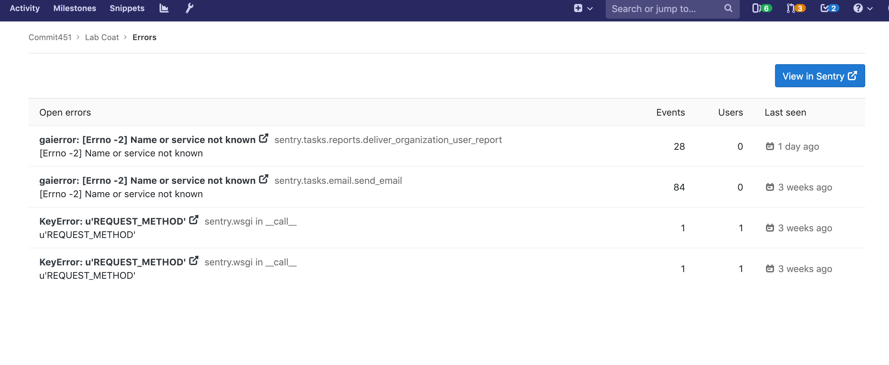

# Error Tracking

> [Introduced](https://gitlab.com/groups/gitlab-org/-/epics/169) in GitLab 11.8.

Error tracking allows developers to easily discover and view the errors that their application may be generating. By surfacing error information where the code is being developed, efficiency and awareness can be increased.

## Sentry error tracking

[Sentry](https://sentry.io/) is an open source error tracking system. GitLab allows administrators to connect Sentry to GitLab, to allow users to view a list of Sentry errors in GitLab itself.

### Deploying Sentry

You may sign up to the cloud hosted <https://sentry.io> or deploy your own [on-premise instance](https://docs.sentry.io/server/installation/).

### Enabling Sentry

NOTE: **Note:**
You will need at least Maintainer [permissions](../../permissions.md) to enable the Sentry integration.

GitLab provides an easy way to connect Sentry to your project:

1. Sign up to Sentry.io or [deploy your own](#deploying-sentry) Sentry instance.
1. [Find or generate](https://docs.sentry.io/api/auth/) a Sentry auth token for your Sentry project.
   Make sure to give the token at least the following scopes: `event:read` and `project:read`.
1. Navigate to your project’s **Settings > Operations** and provide the Sentry API URL and auth token.
1. Ensure that the 'Active' checkbox is set.
1. Click **Save changes** for the changes to take effect.
1. You can now visit **Operations > Error Tracking** in your project's sidebar to [view a list](#error-tracking-list) of Sentry errors.

## Error Tracking List

NOTE: **Note:**
You will need at least Reporter [permissions](../../permissions.md) to view the Error Tracking list.

The Error Tracking list may be found at **Operations > Error Tracking** in your project's sidebar.

