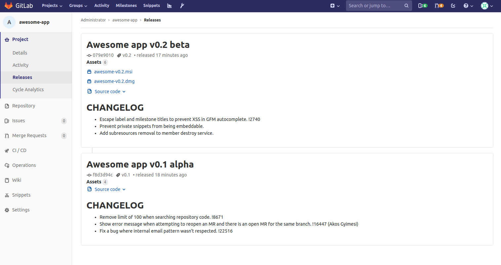

# Releases

> [Introduced](https://gitlab.com/gitlab-org/gitlab-ce/issues/41766) in GitLab 11.7.

It's typical to create a [Git tag](../../university/training/topics/tags.md) at
the moment of release to introduce a checkpoint in your source code
history, but in most cases your users will need compiled objects or other
assets output by your CI system to use them, not just the raw source
code.

GitLab's **Releases** are a way to track deliverables in your project. Consider them
a snapshot in time of the source, build output, and other metadata or artifacts
associated with a released version of your code.

At the moment, you can create Release entries via the [Releases API](../../api/releases.md);
we recommend doing this as one of the last steps in your CI/CD release pipeline.

## Getting started with Releases

Start by giving a [description](#release-description) to the Release and
including its [assets](#release-assets), as follows.

### Release description

Every Release has a description. You can add any text you like, but we recommend
including a changelog to describe the content of your release. This will allow
your users to quickly scan the differences between each one you publish.

NOTE: **Note:**
[Git's tagging messages](https://git-scm.com/book/en/v2/Git-Basics-Tagging) and
Release descriptions are unrelated. Description supports [markdown](../markdown.md).

### Release assets

You can currently add the following types of assets to each Release:

- [Source code](#source-code): state of the repo at the time of the Release
- [Links](#links): to content such as built binaries or documentation

GitLab will support more asset types in the future, including objects such
as pre-built packages, compliance/security evidence, or container images.

#### Source code

GitLab automatically generate `zip`, `tar.gz`, `tar.bz2` and `tar`
archived source code from the given Git tag. These are read-only assets.

#### Links

A link is any URL which can point to whatever you like; documentation, built
binaries, or other related materials. These can be both internal or external
links from your GitLab instance.

## Releases list

Navigate to **Project > Releases** in order to see the list of releases for a given
project.

